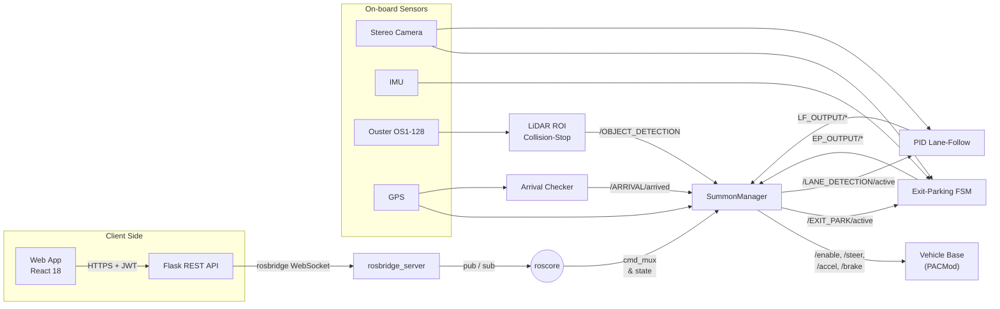

<!-- ===================================================================== -->
# GEM Summoner 🚗 — Autonomous “Summon” Feature for the GEM e2
[](https://ece.illinois.edu/)
[](http://wiki.ros.org/noetic)
[](#license)


[](https://youtu.be/guBvMg3KNeQ)

📽️ Click the image above to watch the full demonstration on YouTube.


A full-stack **ROS (Noetic)** system that lets a GEM e2 neighborhood-electric vehicle **drive itself from any parked bay on a closed track to a user-selected GPS waypoint**, while it:

* **Exits parking bays** autonomously  
* **Follows lanes** (straight & curved) with a tuned PID controller  
* **Avoids obstacles** in real time using an **Ouster** LiDAR ROI filter  
* **Stops precisely** at the summon point once position *and* heading criteria are met  

Project by **Neel Patel, Pusan Chakraborty, Rohith Madhavan, Steffen Brown** (UIUC ECE 484, Spring 2025).

---

## 📑 Table of Contents
1. [Project Motivation](#project-motivation)  
2. [System Architecture](#system-architecture)  
3. [Key Algorithms](#key-algorithms)  
4. [Quick Start](#quick-start) 
5. [Demonstrations](#demonstrations)  
6. [Results & Metrics](#results--metrics)  
7. [Contributors](#contributors)  
8. [License](#license)  

---

## Project Motivation
Valet-style “summon” features usually rely on HD maps and expensive sensors.  
Our mission: **deliver similar user convenience on a low-cost GEM e2** using only

* Phone + on-board GPS,  
* A single **Ouster OS1-128** LiDAR, and  
* Lightweight classical control (no heavyweight ML stack).  

The result is a **portable reference design** suitable for many small-EV platforms.

---

## System Architecture


## Key Algorithms

### Exit-Parking FSM  
Pulls the vehicle smoothly out of a diagonal bay.  
* Inputs : Stereo Camera + IMU  
* Tuned parameters : pull-forward distance, heading correction  
* RMS lateral error during exit : **≤ 0.10 m**

---

### PID Lane-Follow  
Enhanced Stanley/PID hybrid that tracks centerline on straights and curves.  
* Sensor : Stereo Camera  
* RMS lane error (straight) : **0.07 m**  
* RMS lane error (curve) : **0.15 m**

---

### LiDAR ROI Collision-Stop  
Real-time obstacle detection using an OS1-128 ROI.  
* ROI bounds : `0.5 m < x < 5 m`, `|y| < 1 m`, `ring 62–128`  
* Obstacle threshold : 50 points inside ROI  
* Stop accuracy : **100 %** (50/50 trials)

---

### Arrival Checker  
Stops the vehicle exactly at the summon point.  
* Condition 1 : GPS distance to goal < **4 m**  
* Condition 2 : Vehicle heading ⟂ goal vector (± 15°)  
* Outputs : `/ARRIVAL/arrived` flag to SummonManager

---

### SummonManager (FSM Orchestrator)  
Activates modules and multiplexes PACMod commands.  

| State | Active Module     | PACMod Source     |
|-------|-------------------|-------------------|
| **0** IDLE         | –                  | Park + full brake   |
| **1** EXIT         | Exit-Parking FSM   | `/EP_OUTPUT/*`      |
| **2** LANE FOLLOW  | PID Lane-Follow    | `/LF_OUTPUT/*`      |

---

### Data Flow Summary

| Source              | Topic                                 | Role                             |
| ------------------- | ------------------------------------- | -------------------------------- |
| Web App             | `/WEBAPP/goal_lat`, `/goal_long`      | Provides target GPS location     |
| GPS Receiver        | `/navsatfix`                          | Supplies current position        |
| Arrival Checker     | `/ARRIVAL/arrived`                    | Triggers final stop condition    |
| Object Detection    | `/OBJECT_DETECTION/stop` / `/restart` | Triggers emergency stop/resume   |
| Exit-Parking Module | `/EP_OUTPUT/*`                        | Sends control commands (State 1) |
| Lane-Follow Module  | `/LF_OUTPUT/*`                        | Sends control commands (State 2) |

---

### Command Multiplexing by FSM State

```plaintext
FSM:        [IDLE]         [EXIT]           [LANE FOLLOW]
------------------------------------------------------------
Enable:     True           EP_ENABLE        LF_ENABLE
Gear:       PARK           EP_GEAR          LF_GEAR
Steer:      0.0            EP_STEER         LF_STEER
Accel:      0.0            EP_ACCEL         LF_ACCEL
Brake:      1.0 (Full)     EP_BRAKE         LF_BRAKE
```

---

### Activation Logic

```python
if fsm_state == 1:
    self.exit_parking_active_pub.publish(True)
    self.lane_detection_active_pub.publish(False)
elif fsm_state == 2:
    self.exit_parking_active_pub.publish(False)
    self.lane_detection_active_pub.publish(True)
else:
    self.exit_parking_active_pub.publish(False)
    self.lane_detection_active_pub.publish(False)
```

> SummonManager switches which module is “active” and routes PACMod commands from that module to `/pacmod/as_rx/*`.

---

### Arrival Detection

Vehicle transitions to IDLE and stops when:

* Distance to target < `4.0 meters`, and
* Heading vector is perpendicular to target vector

These conditions are computed from GPS (`/navsatfix`) and INS heading.

---

### Obstacle Handling

```text
/OBJECT_DETECTION/stop     → Triggers emergency brake
/OBJECT_DETECTION/restart  → Resumes from last FSM state
```

If an obstacle is detected, SummonManager overrides control and holds full brake. Once cleared, FSM resumes automatically.

## 🚀 Quick Start

### ✅ Requirements

- **OS**: Ubuntu 20.04  
- **ROS**: Noetic Ninjemys  
- **Python**: 3.8  
- **Hardware**: GEM e2 (PACMod enabled), Ouster OS1-128, GPS, IMU, Stereo camera

---

### 🧰 Installation

```bash
# Install ROS Noetic
sudo apt update
sudo apt install ros-noetic-desktop-full

# Source ROS
echo "source /opt/ros/noetic/setup.bash" >> ~/.bashrc
source ~/.bashrc

# Clone and build the workspace
mkdir -p ~/catkin_ws/src && cd ~/catkin_ws/src
git clone https://github.com/steffen-brown/ece484-final.git
cd ~/catkin_ws
catkin_make
source devel/setup.bash

### 🧪 Runtime: 4-Terminal Setup

>  **Before You Begin**
>
> - Restart the **Flask API** and wait **~60 seconds** for initialization.  
> - Confirm GPS location is correct on the **Summon web interface**.  
> - Then, **log in** and click **Summon** when ready.

---

### 🖥️ Terminal 1 — Launch Sensors

```bash
roslaunch basic_launch sensor_init.launch
```

Initializes LiDAR, GPS, IMU, and stereo camera nodes.

---

## 🖥️ Terminal 2 — Activate Joystick Mode

```bash
roslaunch basic_launch dbw_joystick.launch
```

Enables joystick-based drive-by-wire control.

---

## 🖥️ Terminal 3 — Run Summon Nodes

```bash
cd ~/catkin_ws/src/ece484-final/GEM\ Code/src/vehicle_drivers/summon/launch
./run_nodes.sh
```

This script launches all core ROS nodes (with 2s spacing):

- `summon_manager.py`  
- `lane_detection.py`  
- `object_avoidance.py`  
- `networking_node.py`  
- `arrive.py`  
- `exit_parking.py`  
- `lf_pid.py`

---

### 🛑 Terminal 4 — Kill All Nodes (When Done)

```bash
cd ~/catkin_ws/src/ece484-final/GEM\ Code/src/vehicle_drivers/summon/launch
./kill_nodes.sh
```

Stops all background nodes cleanly.

---

## 🌐 Web Interface

Open your browser and go to:

```bash
https://gem-summon-frontend.onrender.com/
```

Then:

1. **Log in** with your credentials  
2. Verify GPS fix is accurate on the map  
3. Click **Summon** to trigger the full motion pipeline:
   - Exit Parking → Lane Follow → Obstacle Avoidance → Arrival

## 🎥 Demonstrations

📽️ [Click to watch the full demo video](videos/summon_demo.mp4)


